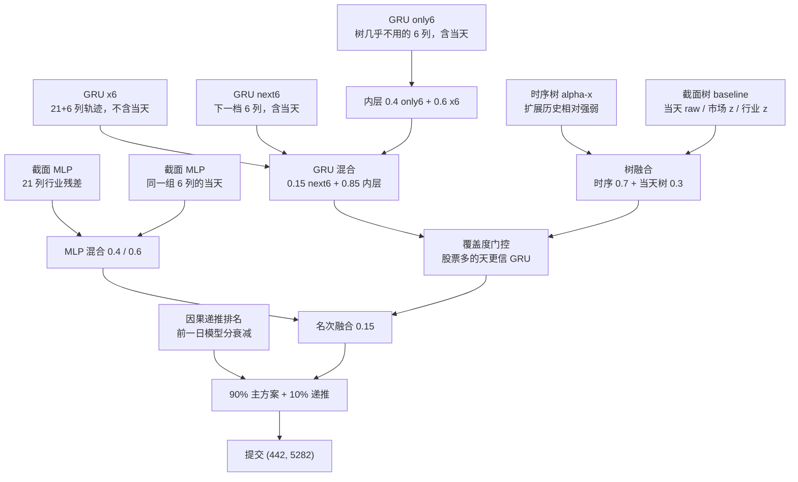

# 靖戈企业命题一 · 技术方案说明书

课题 1（标签 `y1`）。用市场面板预测每只股票当日「潜力」，评价的是横截面排序，不是单点误差。

本文对应评分里的设计、体验与创新。结果数字以平台测试集为准；本地验证集只用于选模。复现命令见 [`README.md`](README.md)。

## 1. 指标

官方 RankIC：每个交易日，在有效股票上对预测与标签算 Spearman 等级相关，再对时间取均值。测试集门槛 **≥ 0.12**。

本仓库用同一套实现（`src/metrics.py`）做训练验收和对比实验。损失可以用 MSE 或 Pearson IC，**验收永远是 RankIC**。

锁定文件 `submissions/task1_fusion_existing_recursive_w10.npy`：

- 本地 valid：**0.130825**
- 平台 test：**0.129291**（已过官方门槛 0.12）

形状 `(442, 5282)`，`float32`，`np.load` 无参可读。主方案是 alpha-x 树 + 原 GRU/MLP/覆盖度门控，再以 10% 混入带衰减的因果递推排名。测试标签不进入训练与特征。

## 2. 方法：时间维 + 股票维，再融合

官方提示有两条：在时间维建模通常更好；也可以在股票维建模并与时序结果融合。主方案把两条都做成可训练的支，而不是只换网络名字。

权重只在 243 天验证集上从小网格里锁死，再对测试集推理一次。测试集标签不可见，不能拿来搜参。

## 3. 时间维：轨迹，不是原始水平

树侧历史特征用的是过去窗口内、每天先做全市场 z-score 之后的 mean / std / last。用原始价格水平当历史，验证集会掉分（0.100 → 0.084），所以丢掉了。含义是：模型看的是「这只股票相对全市场的位置怎么走」，不是绝对数值。主树锁定为 alpha-x：全训练期 DoubleEnsemble，历史列扩到经扫描保留的互补特征，窗口 20 日，再与当天截面树按 0.7 / 0.3 合成。

GRU 侧每只股票一条短序列（窗口 10），输入同样是截面 z-score。主 GRU 支 **不看当天**，避免和已经吃进当天截面的树重复。训练只用 train 末 800 天、每天最多 2000 只：这段日子的覆盖度更接近验证集「股票很多」的天。架构是 1 层 GRU、hidden 64，CPU 可跑完。

另外两支 GRU 不把新列塞进同一张网，而是单独训练：树几乎不用、但单因子不弱的列（42、58、66、69、73、74），以及再下一档（38、72、47、3、1、4）。并进原网络会和旧 GRU 高度相关（约 0.95），融合没有新信息；分开之后相关下降，才能加分。

## 4. 股票维：当天相对位置

当天截面 LightGBM 用 raw 99 列 + 全市场 z-score + 行业内 z-score，加上低/中基数类别（不用疑似股票 ID 的高基数列）。这是快基线，也是融合底仓里的「今天长什么样」。

行业残差 MLP 只吃树不太用的行业相对特征和一个低基类别 embedding，标签先减去当天行业均值，损失用 Pearson IC。它单模弱于树，但和树的日分数相关低，能补树失效的日子。6 列当天 MLP 同理：补 GRU 轨迹支里「当天」那一块。

## 5. 融合：覆盖度门控

验证集上，当天有效股票特别多的时候，树的 RankIC 会掉、GRU 相对更好。门控用的是 **当天** `mask_x` 计数，阈值 4546（验证集覆盖度约 60 分位）：低于阈值时 GRU 权重 0.25，高于则 0.6。不看未来日，不看测试标签。

最后把 MLP 混合按名次以 0.15 叠到门控分数上。测试区间在最后已知标签日之后不再使用真实 `y1`，只把模型前一日的横截面排名按时间衰减混入当日模型分；锁定提交再以 10% 权重接入这条递推支。

## 6. Mask 与因果

- 训练损失和 RankIC 只在 `mask_y=True` 的点上算
- 推理对全部 5282 列出分，无特征位置填 0，保证提交形状不被拒
- 窗口只回看 `[t-L, t)` 或含当天 `t`，从不看 `t+1`
- 截面 / 行业 z-score、覆盖度、行业中性化都只用当天
- 缓冲 486 天可以给窗口当历史，但它们的 `y1` 不进训练集（官方 train 从 486 起）
- 不用 `y2` 当 `y1` 的特征

## 7. 消融（同一套 RankIC）

| 方案 | valid mean RankIC |
|---|---|
| 最强单列 | 约 0.079 |
| 当天截面树 | 0.0999 |
| 历史相对强弱树 | 0.1042 |
| 两棵树融合 | 0.1062 |
| 再加 GRU + 门控 + 原 MLP | 0.1172 |
| 再加独立 6 列 GRU 支 | 0.1202 |
| 再加 next6 GRU + 6 列 MLP | 0.1205 |
| alpha-x 扩展历史树替换主树 | 0.1228 |
| 锁定：再混 10% 因果递推排名 | **0.1308** |
| 平台 test（同一文件） | **0.1293** |

官方测试略低于本地验证，但仍过线。完整对照和抛弃项写在 `experiments.md`。

明确不做、做过且更差的方向包括：LambdaRank、把市场状态塞进树、在训练集难日上拟合残差、把类别或高基数编号直接喂模型、三档覆盖度门控、强时序平滑、用测试期真实 `y1` 当特征。验证集太短，0.001 量级抖动不当作成绩。

## 8. 体验与复现

日常入口只有三条：建虚拟环境、写数据路径、跑 `scripts/reproduce.py`。配置驱动，数据 / 训练 / 提交分开。种子 42。本机约 16GB 内存、CPU，不要求 GPU；从零顺序训练约 1.5–2.5 小时，已有预测时融合数分钟。不要并行读两份整包面板。

预测文件和 checkpoint 不进 git。提交格式由 `src/submit.py` 写完再读回自检。

## 9. 创新点（短述）

**双轴。** 时间维学相对强弱怎么走，股票维学当天在市场和行业里站在哪。官方两条提示都落成可消融的支，而不是口号。

**互补列单独成支。** 新信息不并进旧网络，避免相关涨上去、融合失效。门控只看当天覆盖度：股票挤的天更信轨迹模型。测试期用模型自身的前一日排名做衰减递推，不把真实标签带进未来日。

**Mask 感知的排序目标。** 样本、损失、指标共用官方 mask；无效位置不影响 RankIC，又保证提交矩阵完整。优化过程可以回归，验收只认排序。
